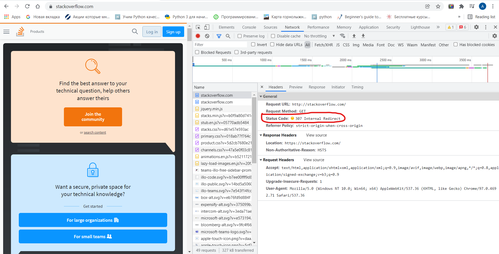

# Netology_devops_net-1

1. 
```vagrant@vagrant:/etc/systemd/system$ telnet stackoverflow.com 80
Trying 151.101.129.69...
Connected to stackoverflow.com.
Escape character is '^]'.
GET /questions HTTP/1.0
HOST: stackoverflow.com

HTTP/1.1 301 Moved Permanently
cache-control: no-cache, no-store, must-revalidate
location: https://stackoverflow.com/questions
x-request-guid: bd91d8b4-60f3-4a77-bad7-7a6faa97d8bc
feature-policy: microphone 'none'; speaker 'none'
content-security-policy: upgrade-insecure-requests; frame-ancestors 'self' https://stackexchange.com
Accept-Ranges: bytes
Date: Sat, 15 Jan 2022 17:53:49 GMT
Via: 1.1 varnish
Connection: close
X-Served-By: cache-fra19137-FRA
X-Cache: MISS
X-Cache-Hits: 0
X-Timer: S1642269229.098530,VS0,VE184
Vary: Fastly-SSL
X-DNS-Prefetch-Control: off
Set-Cookie: prov=6c150833-28fb-a5eb-0faf-9f8e8287b347; domain=.stackoverflow.com; expires=Fri, 01-Jan-2055 00:00:00 GMT; path=/; HttpOnly

Connection closed by foreign host.
```
Код означает:

301 - код перенаправления 

Код 301 говорит что запрошенный ресурс окончательно переехал по адресу указанному в строке: 

location: https://stackoverflow.com/questions
2. Скриншот консоли в браузере после запуска запроса:

На нем видно, что время загрузки всей страницы - 3,68 с.
   В первом ответе код 307 - редирект на https url
   Больше всего времени заняло открытие корневого документа по url https://stackoverflow.com/. Время обработки - 1,45 с.
   
3.


4.
Провайдер Гранлайн,

Автономная система 24AS203806:


5.

6.
Проблемы с хостом 46.22.56.1:

7.
13 корневых серверов (NS) DNS.
5 серверов(NS), ответственные за зону .google, 4 NS сервера финальных сервера за домен dns.google

А записи:
```
dns.google.             900     IN      A       8.8.4.4
dns.google.             900     IN      A       8.8.8.8
```
```
vagrant@vagrant:/etc/systemd/system$ dig +trace @8.8.8.8 dns.google
```

8. К IP привязано доменное имя dns.google:
```
alexandermed@Alex:/mnt/c/Users/alexa$ dig -x 8.8.8.8
```
